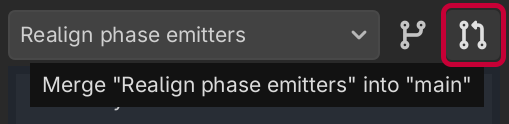
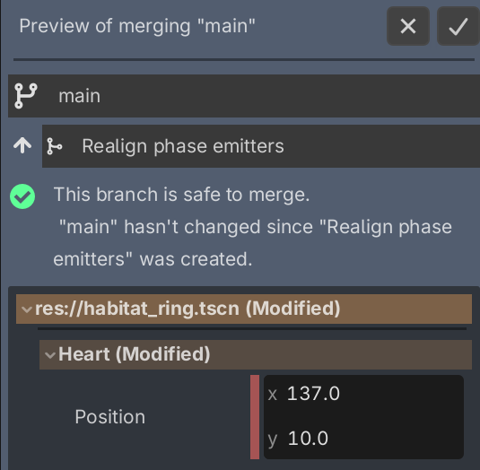

# Using Branches

_Branches_ are a powerful way to organize your work. Each branch is a separate history, started at a given point.

You can use branches for...

- Keeping separate workspaces in the project for individual students
- Working on features that aren't ready for a merge yet
- Collaborating with teammates without overwriting each other's changes

Once a branch is ready, you can merge it back into its parent, automatically integrating your changes while preserving history.

## Creating a Branch

When you're ready to create a branch, click the "Branch" button at the top of the sidebar.

Once you name your branch, you'll have a fresh workspace, isolated from its parent branch. Feel free to make changes!

When no change is selected in History, the "Changes" panel will show all differences between your new branch and the parent. Branches can also be nested; you don't always have to branch off "main".

## Merging a Branch

When you're ready to merge your branch back into its parent, click the "Merge" button:

Then, you'll enter into a "Merge Preview" state. Here, you can inspect the merged changes from both your branch and the parent, and make sure everything looks OK. Backstitch is pretty smart about smoothly merging changes, but it can't read your mind, so make sure to test your changes and adjust anything that doesn't look right!

Once you've made any fixes, click the "Confirm" button in the top right. You'll go back into the original parent branch. If you change your mind and want to work more on your branch, click "Cancel."
