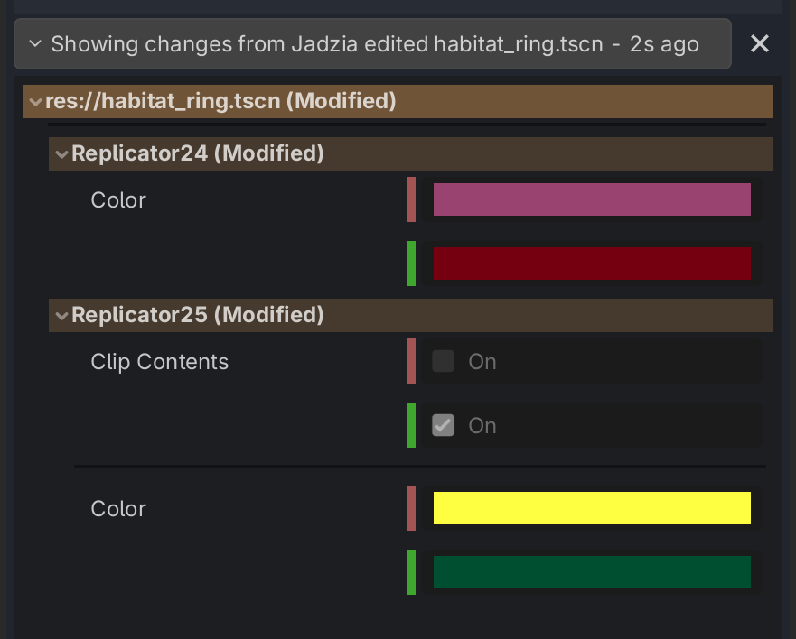

# Making Changes

## Set your username

Start by entering a username in the bottom right corner, if you haven't already. This will help identify you to other collaborators.

## The "Main" Branch

When you start out, you are editing the "Main" branch of your code. Any time you save a file, your changes will be instantly shared with all collaborators in the project!

You can see a log of everyone's changes in the History panel of the Sidebar.

## Inspecting a Change

You can click on a specific change to see the modified properties in the "Changes" panel.

If you mouse-over a node, it will highlight its position in the scene!

