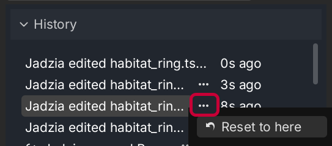
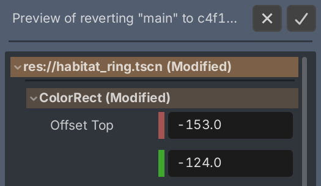

# Reverting Changes

Everyone screws up sometimes. With Backstitch, you can revert a branch to any given change! To revert, right click a change, or click the "..." button on a change. Then, click "Reset to here". Importantly, this operation will revert _to_ a change, not _before_ it. The change you have selected will still be applied, but not any change after it!

Much like merging, a "Revert Preview" mode will open, so you can double-check your revert and make sure it looks OK. The preview shows all the new changes that will be applied -- reversing every change made since the change you selected.

To confirm the revert, press the "Confirm" button at the top right. To stop the revert, press the "Cancel" button.
