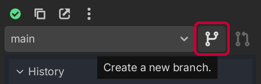
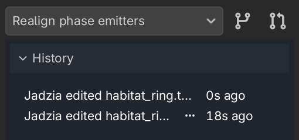

# Usar ramas

Las _ramas_ son una forma potente de organizar tu trabajo. Cada rama es un historial independiente que comienza en un punto determinado.

Puedes usar las ramas para...

- Mantener espacios de trabajo separados dentro del proyecto para cada estudiante
- Trabajar en funciones que aún no están listas para fusionarse
- Colaborar con tu equipo sin sobrescribir los cambios de los demás

Cuando una rama esté lista, puedes fusionarla de nuevo en su rama padre, integrando tus cambios automáticamente y conservando el historial.

## Crear una rama

Cuando estés listo para crear una rama, haz clic en el botón **"Branch"** (rama) en la parte superior de la barra lateral.

Una vez le pongas nombre a tu rama, tendrás un espacio de trabajo nuevo, aislado de la rama padre. ¡Haz los cambios que necesites!

Cuando no haya ningún cambio seleccionado en **"History"** (historial), el panel **"Changes"** (cambios) mostrará todas las diferencias entre tu nueva rama y su padre. Las ramas también se pueden anidar; no siempre tienes que ramificar desde **"main"** (principal).

## Fusionar una rama

Cuando estés listo para fusionar tu rama de nuevo en su padre, haz clic en el botón **"Merge"** (fusionar):

A continuación entrarás en el estado **"Merge Preview"** (vista previa de la fusión). Aquí puedes inspeccionar los cambios fusionados procedentes tanto de tu rama como de la padre, y asegurarte de que todo se ve bien. Backstitch es bastante listo a la hora de fusionar cambios sin sobresaltos, pero no te puede leer la mente, así que asegúrate de probar tus cambios y ajustar cualquier cosa que no esté bien.

Cuando hayas hecho los ajustes necesarios, pulsa el botón **"Confirm"** (confirmar) en la esquina superior derecha. Volverás a la rama padre original. Si cambias de idea y quieres seguir trabajando en tu rama, pulsa **"Cancel"** (cancelar).
