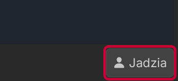
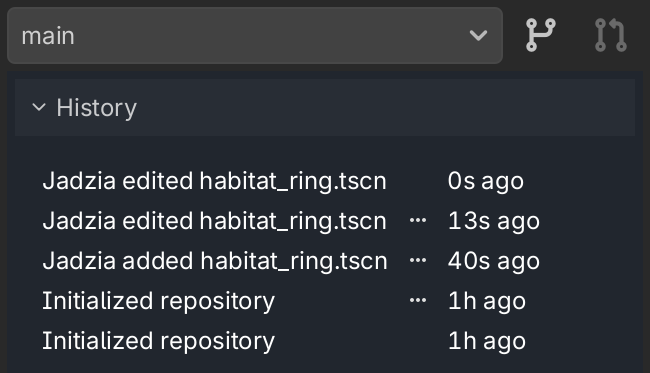
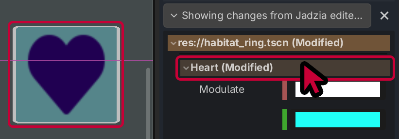

# Realizar cambios

## Configura tu nombre de usuario

Empieza introduciendo un nombre de usuario en la esquina inferior derecha, si aún no lo has hecho. Esto ayudará a identificarte ante el resto de colaboradores.

## La rama **"Main"** (principal)

Cuando empiezas, estás editando la rama **"Main"** (principal) de tu código. Cada vez que guardes un archivo, ¡tus cambios se compartirán al instante con todos los colaboradores del proyecto!

Puedes ver un registro de los cambios de todo el equipo en el panel **"History"** (historial) de la barra lateral.

## Inspeccionar un cambio

Puedes hacer clic en un cambio concreto para ver las propiedades modificadas en el panel **"Changes"** (cambios).

Si pasas el ratón por encima de un nodo, ¡se resaltará su posición en la escena!

