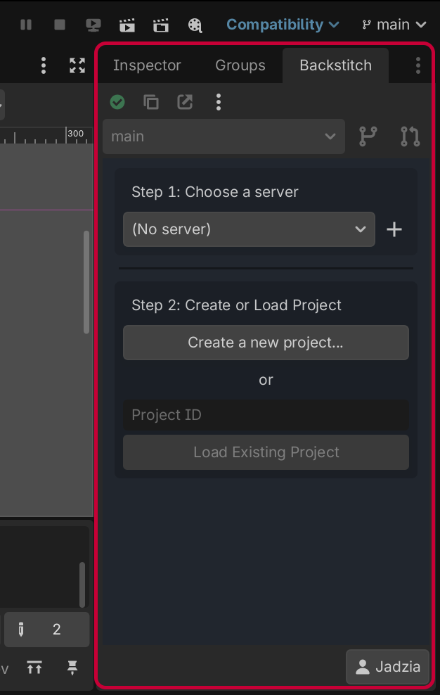
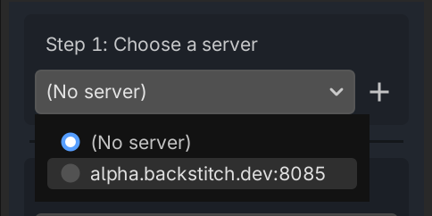
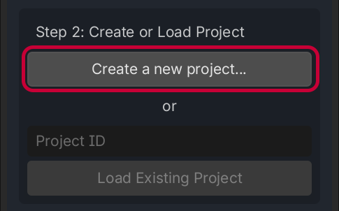

# Configuración del proyecto y del servidor

Cuando inicies un proyecto con Backstitch, aparecerá una nueva barra lateral junto al inspector. La barra lateral de Backstitch es donde interactuarás con toda la funcionalidad del plugin.

Antes de continuar, deberás elegir un servidor. Puedes usar nuestro [servidor de pruebas alfa](../../server/alpha-server.md) o [hospedar tu propio servidor](../../server/host.md). También puedes seguir sin conexión sin ningún servidor seleccionado, pero no tendrás las funciones de sincronización en vivo con tus colaboradores.

Una vez seleccionado el servidor, tienes que crear o unirte a un proyecto de Backstitch. Para crear un proyecto, simplemente pulsa el botón **"create a new project"** (crear un nuevo proyecto).

Cuando creas un proyecto, todo tu proyecto de Godot se sube a Backstitch y se sincroniza con el servidor seleccionado. Puede tardar un rato, ¡así que ten paciencia!

Como alternativa, si tienes un ID de proyecto que alguien te ha compartido del mismo servidor, puedes [cargar su proyecto en su lugar](../sharing.md).
