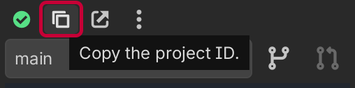
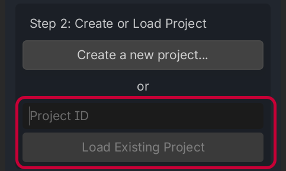
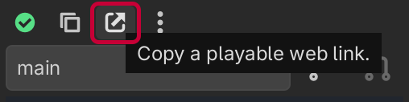

# Comparte tu proyecto

Ahora que has creado un proyecto de Backstitch, puedes compartirlo con otras personas.

## Compartir mediante el ID del proyecto



Pulsa el botón **"Copy Project ID"** (copiar ID del proyecto) en la cabecera de la barra lateral para copiar el ID del proyecto al portapapeles. El ID del proyecto es un identificador único que se ve más o menos así:

```
2mtHkfkTi7FKVLk7CmFexhA1rm3Y
```

Cuando tengas ese ID, puedes compartirlo con otras personas que tengan una copia del proyecto (ya sea por Git o compartida en un archivo `.zip`) y que tengan Backstitch instalado. Como colaborador o colaboradora, introduce un ID de proyecto aquí y haz clic en **"Load Existing Project"** (cargar proyecto existente):



Una vez sincronizados (puede tardar un rato en cargar), ¡podréis empezar a editar archivos juntos!

## Compartir mediante una URL web

Si estás usando el [servidor de pruebas alfa](../../server/alpha-server.md), puedes copiar un enlace web jugable:



Este enlace te permitirá jugar a cualquier rama de tu proyecto en el navegador. Si lo deseas, descarga un archivo `.zip` de todo el proyecto para empezar a editar de inmediato.

Si no estás usando el servidor de pruebas alfa, esta función todavía no está disponible. Aún estamos trabajando para implementarla en el servidor de sincronización de código abierto. ¡Atento a las novedades!
