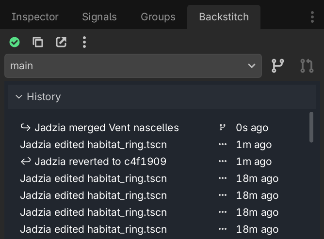

# Welcome to Backstitch!

Backstitch provides real-time, live version control for Godot. It's great for indie teams, classrooms, and game jams – and anyone else who collaborates in Godot!

**Please connect with us!** Fill out [this Google Form](https://docs.google.com/forms/d/1UnSvRhMLkdjE9uQjgnohzChIZhQziQMIeQyRDvIuIiU/) to chat with us directly about your use-case, and get personalized support. We want to connect with as many types of users as possible, to make Backstitch the best it can be!

    <a href="https://docs.google.com/forms/d/1UnSvRhMLkdjE9uQjgnohzChIZhQziQMIeQyRDvIuIiU/" target="_blank" class="button no-underline inline-block">Fill out this form to get started!</a>

Once you're ready to give Backstitch a try:

- [Start here](./installation/index.md) to get Backstitch set up on your machine.
- Once you're all set up, jump into the [tutorial](./tutorial/index.md)!

### Disclaimer

Backstitch is **alpha-grade software**. Please don't rely on Backstitch as your only version control. We strongly recommend:

- Maintaining separate backups while testing
- Only using it in low-risk situations
- Always using an underlying filesystem version control like Git

**About the sync server**: You are free to use our [alpha test server](./server/alpha-server.md), but we cannot guarantee long-term data availability on this server, or data security. Please use it for testing purposes only. However, the sync server is optional. Even without it, you can work offline and retain all your data locally, similar to Git. You're also welcome to [host your own server](./server/host.md)!

